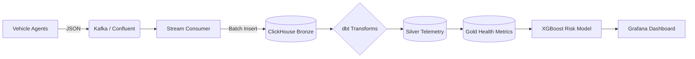

# CanFlow: High-Fidelity Vehicle Telemetry & Risk Prediction Pipeline

[](https://www.python.org/)
[](https://xgboost.readthedocs.io/)
[](https://clickhouse.com/)
[](https://www.getdbt.com/)

CanFlow is a complete, end-to-end data engineering and machine learning platform for vehicle health monitoring. It features a physics-based multi-agent simulator that emits realistic OBD-II and GPS data, a real-time streaming pipeline, a dbt-powered data warehouse, and an XGBoost risk prediction model.

---

## 🚀 Key Features

### 📡 High-Fidelity Simulation
*   **Physics-Based Correlations**: Real-world relationship modeling where Air Flow (MAF) depends on RPM/Throttle, and Engine Temperature scales with Load.
*   **Latent Environmental Noise**: Hidden variables like `ambient_temperature` and `road_incline` create realistic signal overlap.
*   **Pre-Failure "Smells"**: Sensors exhibit latent instability (jitter and drift) for a duration before triggering hard anomalies.
*   **Diverse Fleet**: Supports 25+ unique Indian vehicle models across Passenger (12V) and Commercial (24V) classes.

### ⚡ Real-Time Streaming & Warehouse
*   **Kafka Integration**: Live streaming of JSON telemetry via Confluent Cloud with Schema Registry validation.
*   **ClickHouse Storage**: High-performance OLAP storage for millions of telemetry rows.
*   **dbt "Elastic" Scoring**: A sophisticated health scoring engine in the Gold layer that uses nonlinear penalties and "dead zones" to handle normal high-load operating ranges.

### 🤖 Machine Learning
*   **XGBoost Risk Prediction**: A robust classifier that identifies at-risk vehicles using latent indicators (MAF/RPM efficiency, voltage volatility) rather than simple threshold breaks.
*   **Anti-Leakage Design**: Built to avoid "label leakage" by hiding deterministic SQL triggers from the model, resulting in a realistic **AUC-ROC of ~0.97**.

---

## 🏗️ Architecture



---

## 🛠️ Tech Stack
*   **Language**: Python 3.x
*   **Streaming**: Confluent Kafka
*   **Database**: ClickHouse (OLAP)
*   **Warehouse**: dbt (Data Build Tool)
*   **ML**: XGBoost, Scikit-Learn, Pandas
*   **Visualization**: Grafana
*   **Infrastructure**: Docker Compose

---

## 🏁 Getting Started

### 1. Prerequisites
*   Docker & Docker Compose
*   Python 3.9+ (Virtual Environment recommended)
*   Confluent Cloud Account (for Kafka/Schema Registry)

### 2. Environment Setup
Create a `.env` file in the root directory:
```bash
KAFKA_BOOTSTRAP_SERVERS=your_server
KAFKA_TOPIC=vehicle_telemetry
CONFLUENT_API_KEY=your_key
CONFLUENT_API_SECRET=your_secret
SCHEMA_REGISTRY_URL=your_url
SCHEMA_REGISTRY_API_KEY=your_sr_key
SCHEMA_REGISTRY_API_SECRET=your_sr_secret

CLICKHOUSE_HOST=localhost
CLICKHOUSE_PORT=8124
CLICKHOUSE_USER=admin
CLICKHOUSE_PASSWORD=password
```

### 3. Installation
```bash
# Clone the repository
git clone https://github.com/yourusername/canflow.git
cd canflow

# Set up virtual environment
python -m venv .venv
source .venv/bin/activate
pip install -r requirements.txt

# Start Infrastructure
docker-compose up -d
```

### 4. Running the Pipeline
```bash
# Start the Fleet Simulator
python simulator/simulator.py

# Start the Stream Consumer
python stream/consumer.py

# Train the ML Model
python train.py
```

---

## 📖 Documentation
Detailed technical guides are available in the `/documentation` folder:
*   [**Machine Learning Journey**](./documentation/ml.md): From label leakage to realistic AUC.
*   [**Known Issues**](./documentation/issues.md): Technical hurdles and resolutions.
*   [**Future Ideas**](./documentation/ideas.md): Roadmap for increasing simulation uncertainty.

---

## 📄 License
This project is licensed under the MIT License - see the [LICENSE](LICENSE) file for details.
