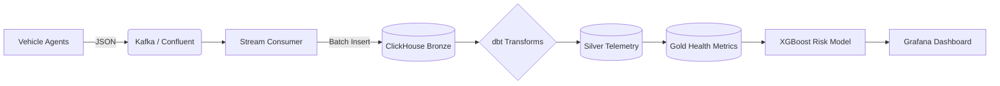

# CanFlow Documentation

Welcome to the CanFlow project documentation. CanFlow is a high-fidelity vehicle telemetry simulator designed to emit realistic OBD-II and GPS data for fleet management and anomaly detection testing.

---

## 🚀 Key Features

### 📡 High-Fidelity Simulation
*   **Physics-Based Correlations**: Real-world relationship modeling where Air Flow (MAF) depends on RPM/Throttle, and Engine Temperature scales with Load.
*   **Latent Environmental Noise**: Hidden variables like `ambient_temperature` and `road_incline` create realistic signal overlap.
*   **Pre-Failure "Smells"**: Sensors exhibit latent instability (jitter and drift) for a duration before triggering hard anomalies.
*   **Diverse Fleet**: Supports 25+ unique Indian vehicle models across Passenger (12V) and Commercial (24V) classes.

### ⚡ Real-Time Streaming & Warehouse
*   **Kafka Integration**: Live streaming of JSON telemetry via Confluent Cloud with Schema Registry validation.
*   **ClickHouse Storage**: High-performance OLAP storage for millions of telemetry rows.
*   **dbt "Elastic" Scoring**: A sophisticated health scoring engine in the Gold layer that uses nonlinear penalties and "dead zones" to handle normal high-load operating ranges.

### 🤖 Machine Learning
*   **XGBoost Risk Prediction**: A robust classifier that identifies at-risk vehicles using latent indicators (MAF/RPM efficiency, voltage volatility) rather than simple threshold breaks.
*   **Anti-Leakage Design**: Built to avoid "label leakage" by hiding deterministic SQL triggers from the model, resulting in a realistic **AUC-ROC of ~0.97**.

---

## 🏗️ Architecture



---

## 🛠️ Tech Stack
*   **Language**: Python 3.x
*   **Streaming**: Confluent Kafka
*   **Database**: ClickHouse (OLAP)
*   **Warehouse**: dbt (Data Build Tool)
*   **ML**: XGBoost, Scikit-Learn, Pandas
*   **Visualization**: Grafana
*   **Infrastructure**: Docker Compose

---

## 🏁 Getting Started

### 1. Prerequisites
*   Docker & Docker Compose
*   Python 3.9+ (Virtual Environment recommended)
*   Confluent Cloud Account (for Kafka/Schema Registry)

### 2. Quick Run
```bash
# Start Infrastructure
docker-compose up -d

# Start the Fleet Simulator
python simulator/simulator.py

# Start the Stream Consumer
python stream/consumer.py
```

---

## 📂 Project Structure

```text
/
├── config/              # Configuration files (YAML)
│   ├── fleet_config.yaml  # Vehicle model profiles & categories
│   └── health_config.yaml # Probabilistic fault & recovery settings
├── dashboard/           # Visualization (Grafana)
├── documentation/       # Technical guides (MkDocs source)
├── models/              # ML artifacts & training logic
├── simulator/           # Data generation (Physics & Kafka)
├── stream/              # Real-time processing & ingestion
├── warehouse/           # Data transformation (dbt SQL)
├── docker-compose.yml   # Infrastructure orchestration
└── README.md            # Repository overview
```

---

## 📄 Technical Guides

*   [**Machine Learning Journey**](ml.md): From label leakage to realistic AUC.
*   [**Known Issues**](issues.md): Technical hurdles and resolutions.
*   [**Future Ideas**](ideas.md): Roadmap for increasing simulation uncertainty.
*   [**Anomaly Detection**](anomalies.md): Stage 1 (Injection) vs Stage 2 (Detection).
